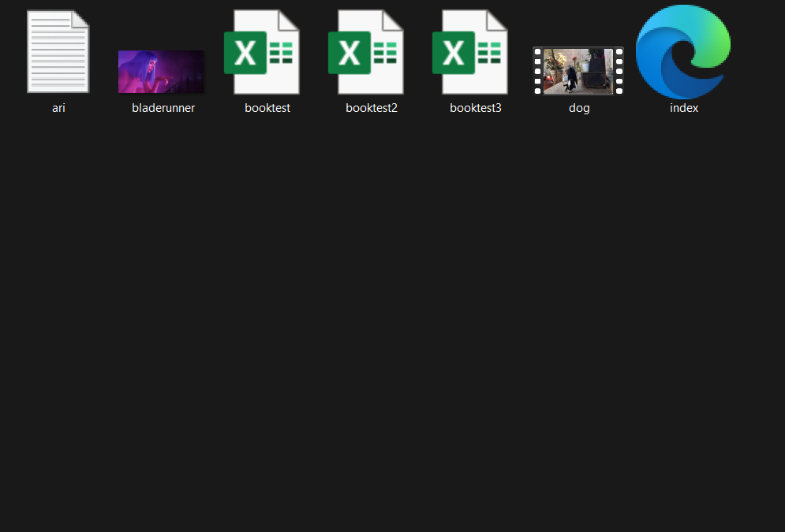
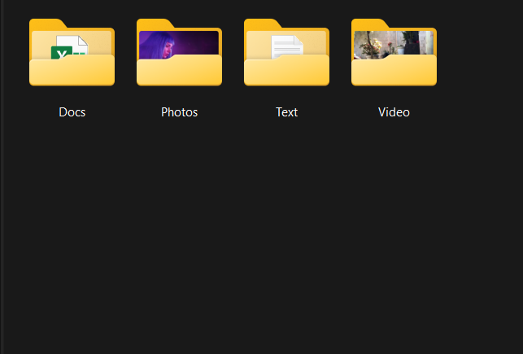

# File Sorter

This project contains two Python scripts to organize files in a directory. Both scripts read a target directory from a `.env` file and automatically move files into subdirectories based on their type.

## Features

- **Two Sorting Modes**:
  1.  `filesorter.py`: A simple script that sorts files into folders named after their file extensions (e.g., all `.jpg` files go into a `Jpg` folder, `.pdf` files into a `Pdf` folder, etc.).
  2.  `filesorter2.py`: A more advanced script that sorts files into predefined categories (e.g., "Photos", "Docs", "Video"). You can customize these categories and their associated extensions directly in the script.

- **Environment-based Configuration**: The target directory is configured via a `.env` file for security and flexibility.
- **Automatic Directory Creation**: The scripts automatically create the necessary destination folders if they don't exist.
- **Console Logs**: Both scripts provide feedback in the console, showing which folders are created and which files are moved.

## Visual Example

Here is a visual example of what the script does when running `filesorter.py`.

### Before


### After


## Setup and Installation

1.  **Clone the repository:**
    ```bash
    git clone <repository-url>
    cd FileSorter
    ```

2.  **Install dependencies:**
    This project uses `python-dotenv` to manage environment variables.
    ```bash
    pip install python-dotenv
    ```

3.  **Create the environment file:**
    Create a file named `.env` in the root of the project and add the path to the directory you want to organize.

    Example `.env` file:
    ```
    PATH_TARGET=C:\Users\YourUser\Downloads
    ```
    Replace the path with your target directory.

## Usage

Once the setup is complete, you can run either of the scripts.

- **To run the simple sorter (by extension):**
  ```bash
  python filesorter.py
  ```

- **To run the advanced sorter (by category):**
  ```bash
  python filesorter2.py
  ```

### How `filesorter2.py` Works

The `filesorter2.py` script uses a dictionary to map file extensions to categories. You can modify this dictionary to fit your needs:

```python
ref = {
    "Photos": [".png", ".jpg", ".jpeg"],
    "Text": [".txt", ".json", ".html"],
    "Video": [".mov", ".mp4", ".wav", ".avi"],
    "Docs": [".pdf", ".docx", ".dotx", ".sql", ".pptx", ".csv", ".xlsx"],
    "Audio": [".mp3"],
    "Executable": [".exe"]
}
```
